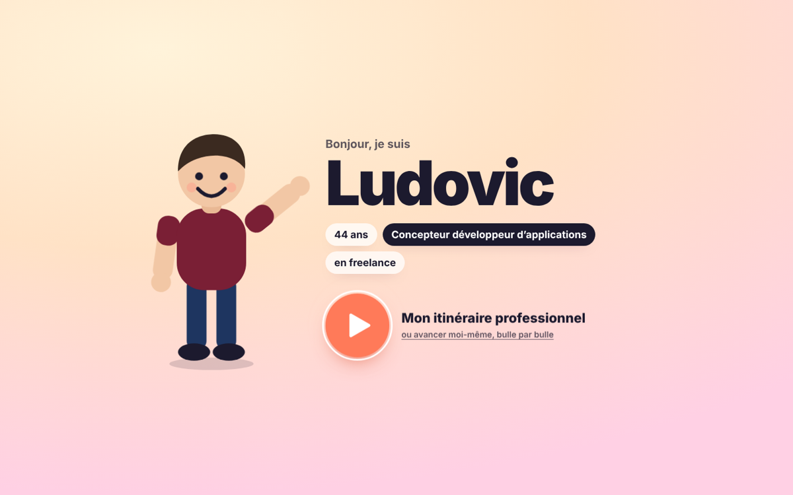
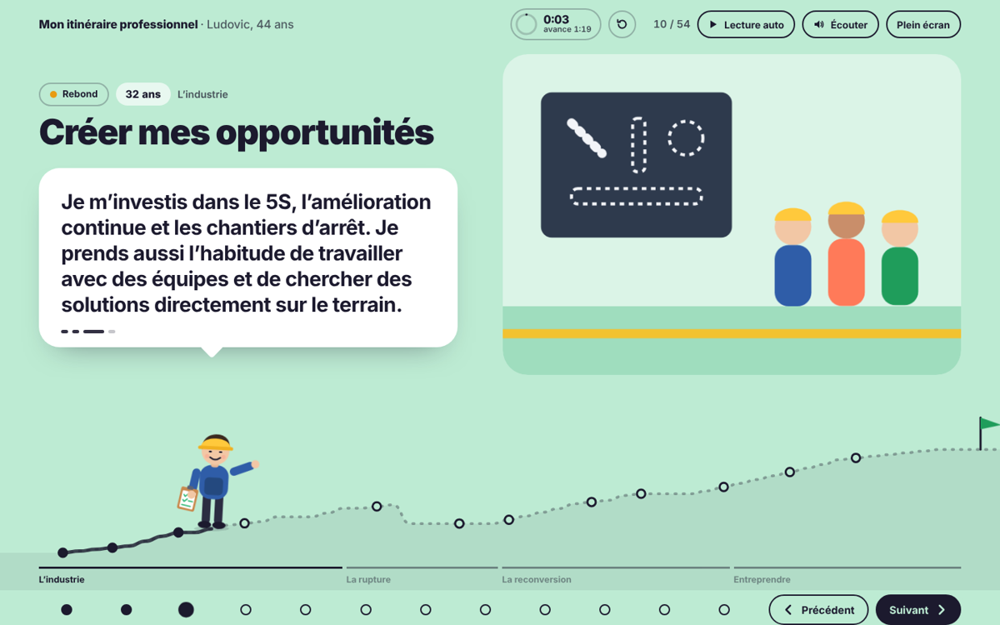
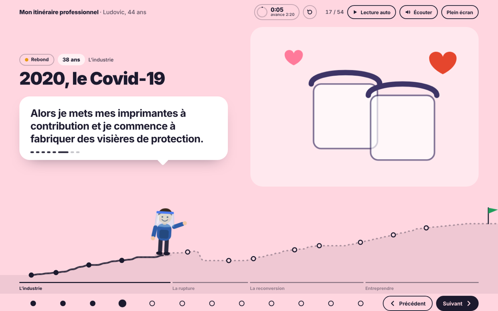
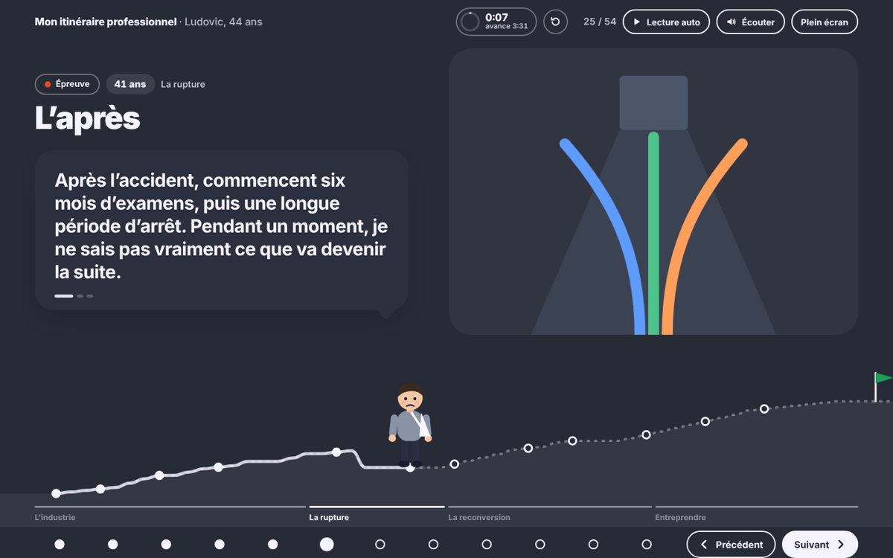
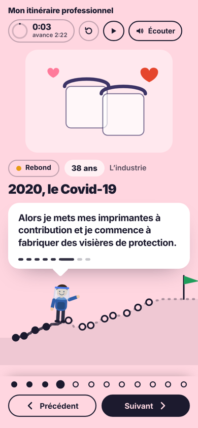

# Mon itinéraire professionnel

Une présentation de carrière de 8 minutes, racontée comme une petite animation : un personnage avance sur un chemin qui monte quand ça avance, reste à plat quand ça stagne et chute au moment de l'accident. 54 bulles, narrées avec ma propre voix, de la maintenance industrielle au développement web.

Conçue pour un séminaire (« racontez votre parcours, réussites et échecs, en 10 minutes maximum »), puis mise en ligne pour être partagée.

**▶ Démo en ligne : [parcours.letempsdunsite.fr](https://parcours.letempsdunsite.fr)**



## Ce qu'elle fait

- **Une histoire en 12 moments et 54 bulles** : lycée technique, Dunlop, DS Smith, impression 3D et visières pendant le Covid, l'accident d'avril 2023, la reconversion, GoSportNow, Le Temps d'un Site.
- **Un personnage qui évolue** : tenue, expression et accessoire changent à chaque époque (marteau, bloc-notes 5S, visière, ordinateur, diplôme…). Il marche d'une bulle à l'autre avec des poses différentes.
- **Un chemin qui reflète le parcours** : son altitude est calculée à partir de chaque étape (réussite, rebond, stagnation, épreuve) et tracée en SVG.
- **Des ambiances par période** : couleurs joyeuses dans les bons moments, fond sombre pour l'accident et le chômage.
- **Une mise en page qui bascule** : texte à gauche puis à droite, pour suivre le personnage quand il « change de voie ».
- **Un mode vidéo** : le bouton play enchaîne les 54 enregistrements audio, la bouche du personnage s'anime pendant qu'il parle, et une page de fin s'affiche toute seule.
- **Un chrono de présentation** : objectif 8 min, limite 10 min, avec un indicateur d'avance ou de retard.
- **Un studio d'enregistrement intégré** (visible en local ou avec `?studio`) : enregistrer sa voix bulle par bulle avec MediaRecorder, stocker les prises dans IndexedDB, les réécouter, puis les exporter en un seul zip généré dans le navigateur.
- **Mobile first** : une colonne sur téléphone, navigation au doigt, au clavier ou automatique.

| Créer mes opportunités (5S) | Covid : les visières |
|---|---|
|  |  |
| **L'après-accident** | **Une autre voie** |
|  |  |



## Technique

- **HTML, CSS et JavaScript, sans framework ni dépendance.** Un seul fichier `index.html`, plus les images et l'audio.
- Le récit est piloté par les données : un tableau `SCENES` décrit chaque moment (titre, âge, couleur, illustration, tenue, accessoire). Les champs se transmettent d'une bulle à l'autre sauf s'ils sont redéfinis.
- Le personnage et les 17 illustrations sont en **SVG inline**. Les membres pivotent via `transform-box: view-box`, et les pas sont des animations CSS.
- Le chemin est une courbe de Bézier calculée en JavaScript. La partie parcourue est animée par `stroke-dasharray`, avec les longueurs mesurées par `getTotalLength()`.
- L'audio passe par l'élément `Audio` : les prises du navigateur passent en priorité, puis les fichiers `voix/NN.mp3`.
- Le zip des prises est écrit à la main (format ZIP « stored » + CRC32), sans bibliothèque.
- Voix nettoyée avec ffmpeg : filtre passe-haut, réduction de bruit, égalisation, de-esser, compression, normalisation à −16 LUFS.
- Respect de `prefers-reduced-motion`, navigation au clavier, `aria-live` sur le texte.

## Lancer en local

Ouvrir `index.html` dans un navigateur, ou servir le dossier :

```bash
npx serve .
```

## Déploiement

Site statique : il suffit de publier le dossier tel quel, par exemple sur Cloudflare Pages, sans commande de build et avec `/` comme dossier de sortie.

---

**Ludovic Fremaut** · Concepteur développeur d'applications, en freelance
[letempsdunsite.fr](https://letempsdunsite.fr) · [gosportnow.fr](https://gosportnow.fr)
